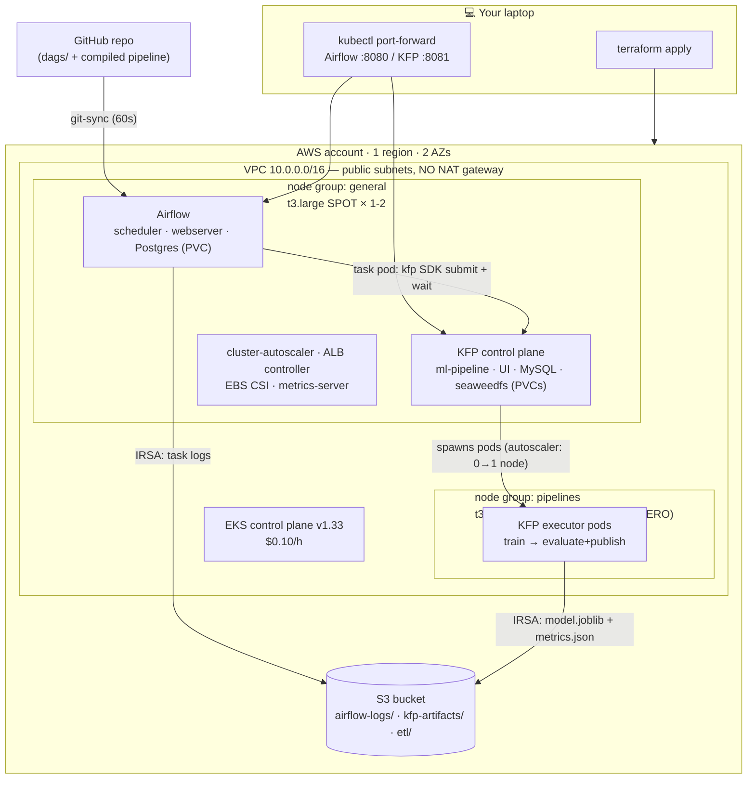

# Airflow + Kubeflow Pipelines on EKS — cost-optimized demo

A **throwaway showcase** that provisions an EKS cluster with Terraform and runs
**Apache Airflow** (KubernetesExecutor) orchestrating a **Kubeflow Pipelines
(KFP)** scikit-learn training pipeline end-to-end, with artifacts and logs in
S3 via IRSA.

Naming notes, so nothing reads like line noise:

* **KFP** = **K**ubeflow **P**ipelines — the ML-workflow engine from the
  Kubeflow project. We deploy only this component, not the full Kubeflow
  platform (see design decisions below).
* **afkf** = **a**ir**f**low + **k**ube**f**low — nothing more than the default
  `project_name` prefix stamped on every AWS resource this repo creates
  (`afkf-demo-eks` cluster, `afkf-demo-mlops-*` bucket, IAM roles…). Change it
  via `project_name` in `terraform.tfvars` if you prefer, but only before the
  first `apply`.

Everything is tuned for **minimum burn rate**, not production resilience:
SPOT nodes, no NAT gateway, no RDS, no load balancers, a scale-from-zero node
group for ML workloads, and a kill switch that parks the whole cluster at
~$2.50/day.

## Contents

- [Architecture](#architecture)
- [What the files in `dags/` are, and why they exist](#what-the-files-in-dags-are-and-why-they-exist)
- [💸 Cost estimate](#-cost-estimate)
- [Prerequisites](#prerequisites)
- [Deploy](#deploy)
  - [Run the demo](#run-the-demo)
  - [Container images: what gets pulled, and from where](#container-images-what-gets-pulled-and-from-where)
  - [Manual steps, called out honestly](#manual-steps-called-out-honestly)
  - [Inspecting the Helm releases from the CLI](#inspecting-the-helm-releases-from-the-cli)
- [🔴 Cost kill switch (park it, don't destroy it)](#-cost-kill-switch-park-it-dont-destroy-it)
- [Teardown](#teardown)
  - [Resources that can leak and keep billing](#resources-that-can-leak-and-keep-billing)
- [Design decisions & tradeoffs](#design-decisions--tradeoffs)
- [Optional: expose Airflow via ALB](#optional-expose-airflow-via-alb)
- [Known gotchas](#known-gotchas)
- [Repository layout](#repository-layout)

---

## Architecture



**The demo flow:** trigger the `train_on_kubeflow` DAG in Airflow → an Airflow
task pod submits `pipelines/sklearn_pipeline.yaml` to the KFP API and waits →
KFP schedules executor pods pinned to the `pipelines` node group → the cluster
autoscaler boots a t3.xlarge **from zero** → the pipeline trains/evaluates a
RandomForest and uploads the model to S3 → the node scales back to zero ~2 min
later → a final Airflow task lists the artifacts in S3.

## What the files in `dags/` are, and why they exist

In Airflow, every workflow is a **DAG** (directed acyclic graph) **defined as
a Python file**. Airflow scans a folder, imports each `.py` file it finds, and
every DAG defined inside becomes a runnable, schedulable workflow in the UI —
no separate deploy step. Without these files Airflow would boot fine but sit
completely empty: they *are* the demo content.

**How they get into the cluster:** you never copy them anywhere. A git-sync
sidecar inside the Airflow pods clones **this GitHub repo** (the
`dags_repo_url` variable) and re-pulls every 60 seconds; Airflow scans the
repo's `dags/` folder. Push a change to `main` and it shows up in the UI
within a minute — that's also why this repo must be reachable (public) from
the cluster.

The two files:

| File | DAG in the UI | What it does | Why it's here |
|---|---|---|---|
| `dags/etl_simple.py` | `etl_simple` | Generates 1 000 fake order rows → aggregates revenue per city → writes `summary.json` to `s3://<bucket>/etl/<date>/` | Smoke test. Proves Airflow schedules task pods and that they can write to S3 **with no credentials configured** (IRSA). Run it first; it finishes in ~1 min. |
| `dags/trigger_kubeflow_pipeline.py` | `train_on_kubeflow` | Submits the compiled KFP package (`pipelines/sklearn_pipeline.yaml`) to the in-cluster KFP API, waits for the run to succeed, then lists the model artifacts that landed in `s3://<bucket>/kfp-artifacts/` | The headline: Airflow *orchestrating* Kubeflow. The KFP SDK isn't baked into the Airflow image — the task pip-installs it in a throwaway virtualenv at runtime. |

Related but different: the `pipelines/` folder is **not** Airflow code — it's
the Kubeflow pipeline (`sklearn_pipeline.py` source → compiled
`sklearn_pipeline.yaml`) that the second DAG submits. It rides along in the
same git-sync clone, which is how the DAG finds the YAML at
`../pipelines/sklearn_pipeline.yaml`.

---

## 💸 Cost estimate

On-demand baselines: t3.large ≈ $0.083/h, t3.xlarge ≈ $0.166/h; SPOT is
typically 60–70 % off. Numbers below assume us-west-2 and will drift — treat
as ±30 %.

| Component | Qty (steady state) | ~$/hour | ~$/day |
|---|---|---|---|
| EKS control plane (standard support) | 1 | 0.100 | 2.40 |
| t3.large SPOT (`general`) | 2 | 0.055 | 1.32 |
| t3.xlarge SPOT (`pipelines`) | **0** idle / 1 during runs | 0 – 0.055 | ~0 |
| EBS gp3 (3× 20 GiB node roots + ~48 GiB PVCs) | ~110 GiB | 0.012 | 0.29 |
| S3 + requests | few GiB | ~0.001 | 0.03 |
| NAT gateway | **0 (disabled by default)** | (0.045 + $0.045/GiB if enabled) | — |
| **Total — idle** | | **≈ 0.17** | **≈ 4.05** |
| **Total — while a pipeline runs** | | ≈ 0.22 | — |
| **Kill switch ON (nodes = 0)** | | **≈ 0.105** | **≈ 2.55** |

Cost traps this repo already avoids — don't reintroduce them:

* **EKS extended support = $0.60/h** (6× the control plane price). Clusters on
  an outdated Kubernetes version get billed this automatically. `cluster_version`
  defaults to a recent version **and** `upgrade_policy.support_type = "STANDARD"`
  opts out of paid extended support entirely.
* **NAT gateway** — off by default; nodes sit in public subnets (inbound still
  closed by the cluster security group).
* **Control-plane CloudWatch logs** — not enabled.
* **Load balancers** — nothing in this repo creates one; UIs are port-forwarded.

---

## Prerequisites

* Terraform ≥ 1.7, AWS CLI v2 (authenticated, e.g. `aws sts get-caller-identity` works), `kubectl`, `git`, `jq`
* Helm is **not** needed locally (Terraform's helm provider does the installs)
* A **public GitHub repo** containing this code — Airflow's git-sync pulls DAGs
  from it (private repos work too but need git-sync credentials; simplest to
  keep the demo repo public)
* Python ≤ 3.12 only if you want to *recompile* the pipeline
  (`pipelines/sklearn_pipeline.yaml` is already compiled and committed)

## Deploy

```bash
# 0. Push this repo to GitHub, then point Airflow's git-sync at it:
cd terraform
cp terraform.tfvars.example terraform.tfvars
$EDITOR terraform.tfvars          # set dags_repo_url (required)

# 1. Provision everything: VPC, EKS, IRSA, S3, addons, Airflow (~20 min)
terraform init
terraform apply

# 2. Point kubectl at the cluster
aws eks update-kubeconfig --region "$(terraform output -raw region)" --name "$(terraform output -raw cluster_name)"

# 3. Install Kubeflow Pipelines standalone (~5 min; see "manual steps" below for why)
cd .. && ./scripts/deploy-kfp.sh

# 4. Open the UIs (no load balancers — SSH-tunnel-style local access)
./scripts/port-forward.sh
#    Airflow → http://localhost:8080  (admin / admin)
#    KFP     → http://localhost:8081
```

Or with make: `make deploy` then `make pf`.

### Run the demo

**Step 1 — smoke test with the ETL DAG (~1 min).**
Open the Airflow UI at http://localhost:8080 (admin / admin). On the DAGs
page, find `etl_simple`, click its pause toggle to unpause it, then press the
▶ (Trigger) button. Within a minute all three tasks should turn dark green
(success). This proves the basics work: Airflow can launch task pods, and
those pods can write to S3 without any credentials (IRSA). Verify the output
landed:

```bash
aws s3 ls --recursive "s3://$(terraform -chdir=terraform output -raw s3_bucket)/etl/"
```

**Step 2 — the main event: trigger `train_on_kubeflow`.**
Unpause and trigger it the same way. Expect the **first run to take ~10
minutes**, because three one-time things happen back to back:

1. the Airflow task pod pip-installs the KFP SDK into a throwaway virtualenv (~2 min),
2. the cluster autoscaler boots a spot t3.xlarge **from zero** for the pipeline pods (~3 min),
3. the pipeline container images are pulled for the first time (~2 min).

Repeat runs skip the node wait and image pulls and finish in ~3–4 minutes.

**Step 3 — watch it happen (optional but the whole point of a demo).**
In a couple of terminals while the run is going:

```bash
kubectl get nodes -w                 # an extra node appears (workload=pipelines), then vanishes ~2 min after the run
kubectl -n kubeflow get pods -w      # the train / evaluate executor pods come and go
```

And in the KFP UI at http://localhost:8081 → *Runs* → the newest
`airflow-triggered-*` run shows the live pipeline graph with per-step logs.

**Step 4 — confirm the result.**
The Airflow run goes green once the pipeline succeeds and the final task has
verified the artifacts; the trained model is now in S3:

```bash
aws s3 ls --recursive "s3://$(terraform -chdir=terraform output -raw s3_bucket)/kfp-artifacts/"
# → .../<timestamp>/model.joblib  and  .../<timestamp>/metrics.json
```

After one run of each DAG, the whole bucket looks like this
(`aws s3 ls --recursive s3://<bucket>/` to see it flat):

```
s3://afkf-demo-mlops-<hex>/
├── airflow-logs/                        # every task's log, written via IRSA (7-day expiry)
│   ├── dag_id=etl_simple/
│   │   └── run_id=manual__2026-07-08T18:02:11+00:00/
│   │       ├── task_id=extract/attempt=1.log
│   │       ├── task_id=transform/attempt=1.log
│   │       └── task_id=load/attempt=1.log
│   └── dag_id=train_on_kubeflow/
│       └── run_id=manual__2026-07-08T18:10:42+00:00/
│           ├── task_id=submit_kfp_run/attempt=1.log
│           └── task_id=report_artifacts/attempt=1.log
├── etl/
│   └── 2026-07-08/
│       └── summary.json                 # DAG 1 output: revenue-per-city aggregate
└── kfp-artifacts/
    └── 20260708-181530/                 # UTC timestamp of the KFP run
        ├── model.joblib                 # the trained RandomForest
        └── metrics.json                 # {"accuracy": 0.97..., "published_at": ...}
```

The `dag_id=/run_id=/task_id=` layout is Airflow's default remote-log naming —
it means the S3 console doubles as a browsable log archive. Note that KFP's
*intermediate* artifacts (what you see attached to steps in the KFP UI) live
in the in-cluster seaweedfs object store, not here: only what the `evaluate_and_publish`
component explicitly uploads reaches this bucket.

### Container images: what gets pulled, and from where

The "pulling images" wait in step 2 happens on the freshly scaled-from-zero
node, which always starts with an empty image cache:

| Image | Registry | Role |
|---|---|---|
| `python:3.11-slim` | Docker Hub | Base image for both pipeline components (set in `pipelines/sklearn_pipeline.py`) |
| `ghcr.io/kubeflow/kfp-launcher` | GitHub (ghcr.io) | Injected by KFP v2 into every executor pod to shuttle inputs/outputs |
| `quay.io/argoproj/argoexec` | Red Hat (quay.io) | Argo sidecar supervising each step's container |
| `amazon-k8s-cni`, `kube-proxy`, `ebs-csi-node` | Amazon regional ECR | DaemonSets every brand-new node pulls before it's Ready |

The components' Python deps (`scikit-learn`, `boto3`) are in **no** image —
KFP pip-installs them at container start (`packages_to_install`), which is a
separate delay paid on *every* run, image cache or not.

The rest of the stack is pulled once at deploy time:

* **Airflow** (`airflow` ns): `apache/airflow:2.10.5` (Docker Hub),
  `registry.k8s.io/git-sync/git-sync`, `bitnamilegacy/postgresql` (Docker Hub)
* **KFP control plane** (`kubeflow` ns): ~10 images, nearly all
  `ghcr.io/kubeflow/kfp-*` (api-server, frontend, persistence-agent…), plus
  `mysql:8.4` and `chrislusf/seaweedfs` from Docker Hub,
  `quay.io/argoproj/workflow-controller`, and one gcr.io holdout
  (`gcr.io/tfx-oss-public/ml_metadata_store_server`)
* **Addons** (`kube-system`): `registry.k8s.io/autoscaling/cluster-autoscaler`,
  `registry.k8s.io/metrics-server/*`, `public.ecr.aws/eks/aws-load-balancer-controller`

So six public registries in total — Docker Hub, ghcr.io, quay.io,
registry.k8s.io, gcr.io, ECR (public + regional) — all reached over the
nodes' public-subnet egress,
which is why the no-NAT design still needs internet access. Docker Hub pulls
are anonymous and **rate-limited**: this demo normally stays well under the
limit, but if you ever see `ErrImagePull` / `toomanyrequests` on
`python:3.11-slim` or the Airflow image, that's it — wait a few minutes, or
switch the base image to `public.ecr.aws/docker/library/python:3.11-slim`
(same image, mirrored on ECR Public, no Docker Hub limits).

**Where the pulls land:** on each node's own 20 GiB gp3 root EBS volume
(`disk_size` in `modules/eks`). EKS AL2023 nodes run containerd, which keeps
image layers under `/var/lib/containerd/`. Three consequences worth knowing:

* The cache is **per node and dies with the node**. That's exactly why the
  scale-from-zero `pipelines` node re-pulls everything on every scale-up (and
  why the `general` nodes, which live long, only pay the pull once). Nodes
  don't share layers — two nodes pulling the same image download it twice.
* The kubelet garbage-collects old images if the disk passes ~85 % full;
  this stack peaks at ~4–5 GiB of images, so 20 GiB never gets close.
* You can inspect a node's cache without SSH — Kubernetes reports it in node
  status:

  ```bash
  kubectl get node <node-name> \
    -o jsonpath='{range .status.images[*]}{.sizeBytes}{"\t"}{.names[-1]}{"\n"}{end}' | sort -rn | head
  ```

If the repeat pulls on scale-from-zero ever bothered you (for this demo they
shouldn't), the standard fixes are an ECR pull-through cache, a warm pool, or
just accepting the ~2 minutes — this repo does the latter.

If `terraform apply` ever fails with a Kubernetes-provider connection error
(rare bootstrap race), run it in two phases:
`terraform apply -target=module.vpc -target=module.eks -target=module.iam && terraform apply`.

### Manual steps, called out honestly

1. **Push the repo + set `dags_repo_url`** — git-sync needs a reachable repo;
   there's no way around this without baking DAGs into an image.
2. **`./scripts/deploy-kfp.sh` after apply** — upstream ships KFP standalone as
   kustomize manifests only (no official Helm chart). Wrapping `kubectl apply -k`
   in a Terraform `null_resource` makes destroys flaky, so it's an explicit,
   idempotent script instead. It also annotates KFP's `pipeline-runner` service
   account with the IRSA role ARN (Terraform can't — the SA doesn't exist until
   the manifests are applied).
3. **Unpause the DAGs** in the Airflow UI before triggering.

### Inspecting the Helm releases from the CLI

Terraform installs everything through Helm, so the `helm` CLI is the fastest
way to see what's actually configured. It talks to your current kubeconfig
context — run `make kubeconfig` first (and `kubectl config current-context`
if you're not sure which cluster you're pointed at).

```bash
helm list -A                                    # all releases in all namespaces
helm get values airflow -n airflow              # the overrides Terraform passed in
helm get values airflow -n airflow --all        # merged with chart defaults = effective config
helm get manifest airflow -n airflow            # the rendered Kubernetes YAML
helm status airflow -n airflow                  # release health / last deploy result
helm history cluster-autoscaler -n kube-system  # revision history of a release
```

To browse a chart's *available* settings before changing the values template:

```bash
helm show values airflow --repo https://airflow.apache.org --version 1.16.0 | less
helm show values aws-load-balancer-controller --repo https://aws.github.io/eks-charts --version 1.8.1
```

---

## 🔴 Cost kill switch (park it, don't destroy it)

Not demoing today? Scale every node group to zero and keep all state:

```bash
./scripts/kill-switch.sh off    # ~30 s → burn rate drops to ≈ $0.105/h
./scripts/kill-switch.sh on     # pods reschedule in ~5 min, state intact
```

`off` pauses the cluster-autoscaler first (otherwise it would immediately
scale back up for the pending Airflow pods), then sets both node groups to
`min=0, desired=0`. The Airflow DB and KFP MySQL/seaweedfs PVCs persist, so
DAG history and pipeline runs survive. A later `terraform apply` also acts
as "on" (it restores `min_size`; `desired_size` is lifecycle-ignored).

## Teardown

```bash
./scripts/teardown.sh           # or: make destroy
```

This is deliberately **more than** `terraform destroy`, in this order:

1. Deletes any `LoadBalancer` Services (none exist by default) — ELBs must be
   removed by Kubernetes *while the cluster is alive* or they leak.
2. Deletes the `airflow` and `kubeflow` namespaces and waits for the PVs to go —
   PVC deletion is what makes the EBS CSI driver delete the backing **EBS
   volumes**. Destroy the cluster first and those volumes are orphaned but
   still billing.
3. `terraform destroy -auto-approve` — the S3 bucket has `force_destroy = true`,
   so it's emptied and deleted (no "bucket not empty" failure, no leaked bucket).
4. Runs `scripts/cleanup-orphans.sh` as a final audit.

### Resources that can leak and keep billing

| Resource | Created by | Leak scenario | Covered by |
|---|---|---|---|
| EBS volumes (Postgres 8 Gi, MySQL 20 Gi, seaweedfs 20 Gi) | EBS CSI driver via PVCs | cluster destroyed before PVCs deleted | teardown step 2; audit via `cleanup-orphans.sh --delete` |
| ALB/NLB/classic ELB + their security groups | LB controller / Services | ingress or LB Service left at destroy time | teardown step 1 + orphan script |
| S3 bucket + objects | Terraform | `force_destroy=false` (not here) or destroy interrupted | `force_destroy=true` + orphan script |
| CloudWatch log groups `/aws/eks/<cluster>/*` | EKS if control-plane logging enabled | logging enabled manually at some point | never enabled + orphan script |
| Orphaned ENIs / EIPs | VPC teardown races | rare; NAT EIP is Terraform-managed | destroy retries; orphan script lists SGs |

`./scripts/cleanup-orphans.sh` is a **dry-run report** (also runnable anytime,
even months later, via `CLUSTER_NAME=afkf-demo-eks AWS_REGION=us-west-2 ./scripts/cleanup-orphans.sh`);
add `--delete` to remove what it finds.

---

## Design decisions & tradeoffs

**Local Terraform state (deliberate).** Remote S3 state + locking is the
correct call for anything shared or long-lived, but for a single-operator
throwaway it adds a bootstrap resource that itself can leak. The tradeoff: if
you lose the `terraform/` directory before destroying, you orphan the stack
(the orphan script + AWS console tag search `Project=eks-airflow-kubeflow-demo`
is your recovery path). A ready-to-uncomment S3 backend block (with TF ≥ 1.10
S3-native locking — no DynamoDB table needed) is in `terraform/versions.tf`.

**Public subnets, no NAT.** Nodes get public IPs; inbound is still blocked by
the cluster security group (nothing opens node ports, SSH is disabled). Saves
~$1.10/day + per-GiB processing. `enable_nat = true` flips to private subnets
behind a **single** NAT gateway if your org policy requires it.

**KFP standalone, not full Kubeflow.** The full platform (Istio, Dex, KNative,
central dashboard…) needs ~4× this cluster. Standalone KFP is the pipelines
engine only, which is exactly what the demo shows.

**Bundled Postgres, not RDS.** "Bundled" means Airflow's metadata database is
not an external AWS service but ships *inside the Helm chart* as a subchart:
a PostgreSQL container running as an ordinary pod in the cluster
(`airflow-postgresql-0` in the `airflow` namespace), its data on an 8 Gi gp3
PVC. Zero extra AWS cost beyond that volume, but no backups, no failover, and
it dies with the cluster — fine for a demo; the first thing to replace with
RDS for anything real.

**Taint on the `pipelines` group.** Guarantees only KFP executor pods (which
carry a matching toleration, added via `kfp-kubernetes` in the pipeline code)
land there, so it reliably scales back to zero. If tolerations misbehave on
some KFP version, set `enable_pipelines_taint = false` and rely on the node
selector alone.

**No custom Airflow image.** The KFP-submitting task runs in
`@task.virtualenv(requirements=["kfp==2.7.0"])` — pip installs at task runtime
(~1 min) instead of maintaining an ECR image. Right tradeoff for a demo,
wrong one for production.

## Optional: expose Airflow via ALB

Port-forwarding costs nothing; an ALB adds ~$0.60+/day — only do this if you
must share the UI. With the
ALB controller already installed:

```yaml
# add to terraform/modules/addons/values/airflow-values.yaml.tpl
ingress:
  web:
    enabled: true
    ingressClassName: alb
    annotations:
      alb.ingress.kubernetes.io/scheme: internet-facing
      alb.ingress.kubernetes.io/target-type: ip
      alb.ingress.kubernetes.io/listen-ports: '[{"HTTP": 80}]'
```

then `terraform apply`. **The ALB is created outside Terraform** — remove the
ingress (or run the teardown script, which handles it) before destroying, and
change the default `admin/admin` login (`webserver.defaultUser` in values)
before exposing anything.

## Known gotchas

* **Don't pin old KFP versions.** Google's Container Registry sunset purged
  many `gcr.io/ml-pipeline` tags, so KFP ≤ 2.5 manifests reference images
  that now 404 (their minio tag, for one). `deploy-kfp.sh` pins 2.16.1, which
  pulls from ghcr.io / Docker Hub / quay.io instead.
* **KFP's result-cache is disabled on purpose.** Its `cache-deployer` mints a
  webhook TLS cert via the Kubernetes CSR API, which EKS's signer refuses for
  non-node identities — it crashloops forever. `deploy-kfp.sh` scales the two
  cache components to zero; harmless here since the sample DAG submits runs
  with `enable_caching=False` anyway.
* **Chart RBAC must match the autoscaler image.** The cluster-autoscaler Helm
  chart ships the ClusterRole; an old chart with a new image (≥ 1.33 needs
  `volumeattachments` list/watch) leaves the autoscaler silently unable to
  scale anything. Symptom: pods Pending forever, `forbidden` spam in its logs.
* **Spot capacity errors** at node-group creation: add more instance types to
  `general_instance_types` / `pipelines_instance_types` or switch region.
* **Bitnami image purge**: Docker Hub `bitnami/postgresql` tags moved in 2025;
  the values file pins `bitnamilegacy/postgresql`. If Postgres ever
  `ErrImagePull`s, that override is the place to look.
* **First `train_on_kubeflow` run is slow** (~10 min) — venv pip install +
  scale-from-zero + image pulls. Subsequent runs ≈ 3–4 min.
* **kfp SDK 2.7 needs Python ≤ 3.12** — only relevant for recompiling the
  pipeline locally; the committed YAML works as-is.
* **Spot interruptions** can kill the scheduler or a mid-run pipeline pod at
  any time. It's a demo; everything restarts and reruns.

## Repository layout

```
eks-airflow-kubeflow-demo/
├── README.md
├── Makefile                          # deploy / pf / stop / start / destroy
├── dags/
│   ├── etl_simple.py                 # DAG 1: extract→transform→load→S3 (IRSA)
│   └── trigger_kubeflow_pipeline.py  # DAG 2: submit KFP run, wait, verify S3
├── pipelines/
│   ├── sklearn_pipeline.py           # KFP v2 source (train → evaluate+publish)
│   ├── sklearn_pipeline.yaml         # compiled package (committed; Airflow submits this)
│   └── requirements.txt              # compile-time deps only
├── scripts/
│   ├── deploy-kfp.sh                 # KFP standalone install + IRSA annotation
│   ├── port-forward.sh               # both UIs, no load balancers
│   ├── kill-switch.sh                # on|off — park nodes at zero
│   ├── teardown.sh                   # ordered destroy (PVCs → ELBs → terraform)
│   └── cleanup-orphans.sh            # post-destroy billing-leak audit [--delete]
└── terraform/
    ├── versions.tf                   # pins + local-state rationale + S3 backend snippet
    ├── providers.tf                  # aws / kubernetes / helm (EKS exec auth)
    ├── variables.tf                  # all cost knobs live here
    ├── main.tf                       # module wiring
    ├── outputs.tf
    ├── terraform.tfvars.example
    └── modules/
        ├── vpc/                      # 2 public subnets; optional private+single-NAT
        ├── eks/                      # cluster, OIDC, 2 SPOT MNGs, autoscaler ASG tags
        ├── iam/                      # 5 IRSA roles (+ vendored ALB policy JSON)
        ├── s3/                       # 1 bucket, force_destroy, lifecycle rules
        └── addons/                   # EBS CSI, gp3 SC, ALB ctrl, autoscaler, Airflow
```
